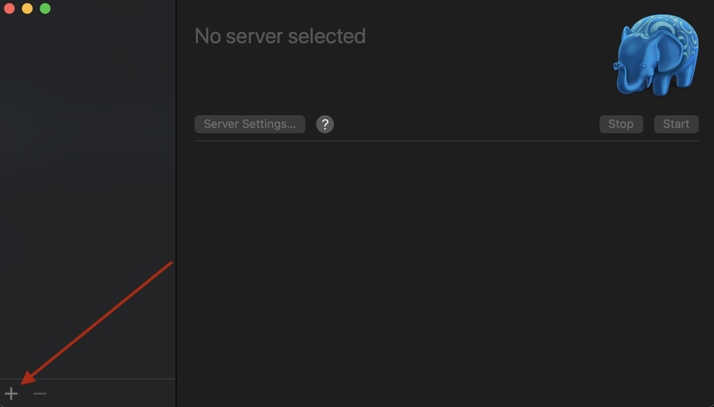
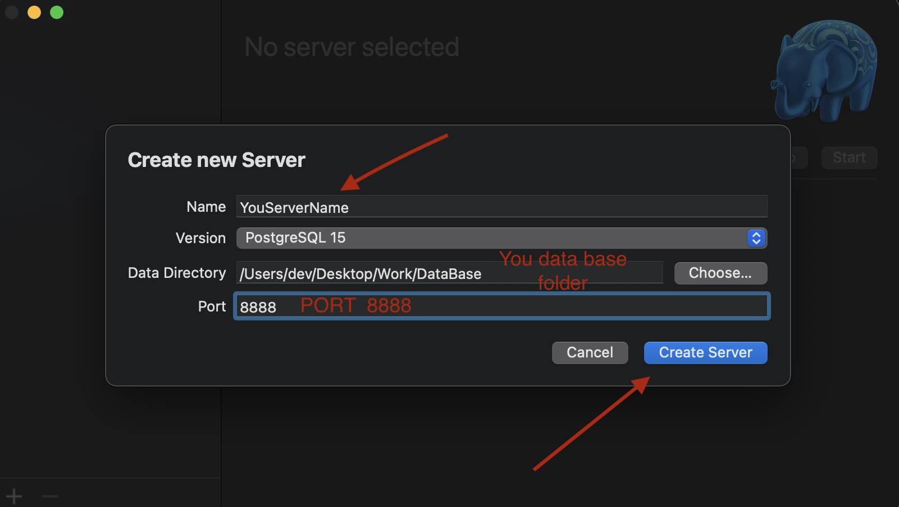
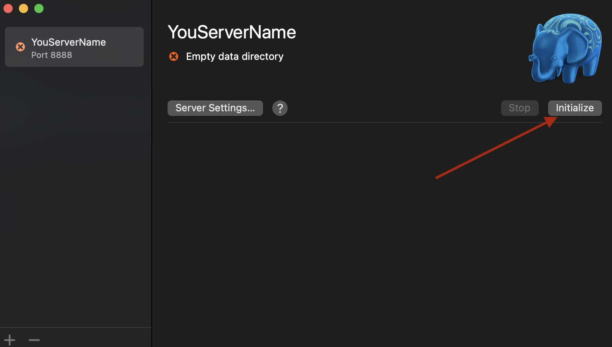
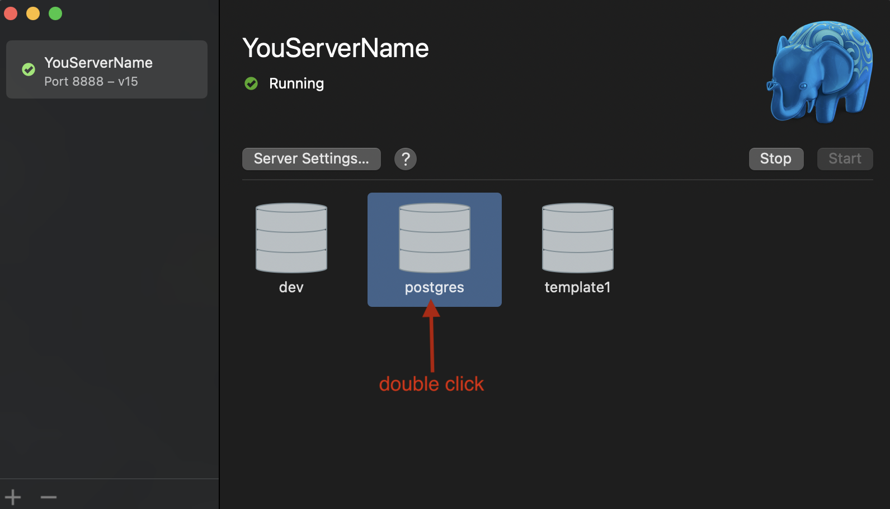
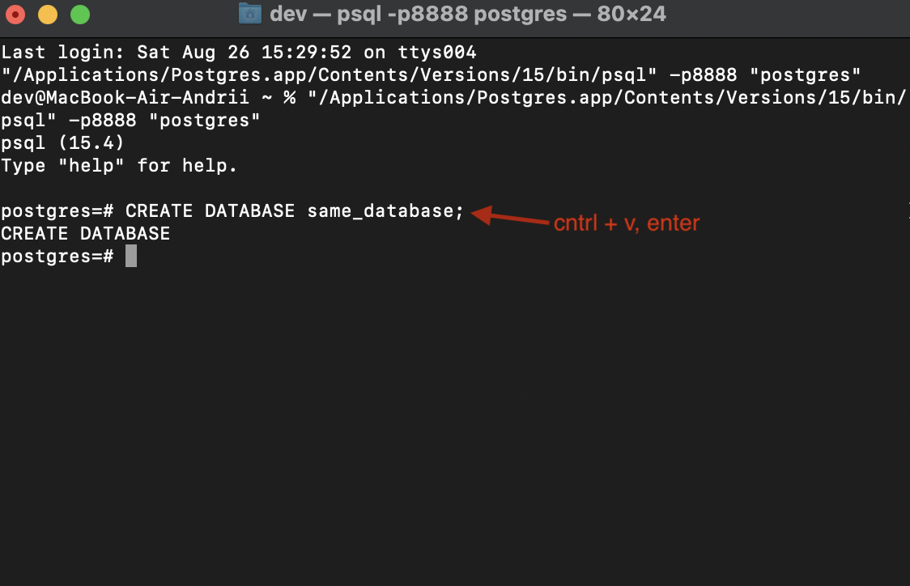
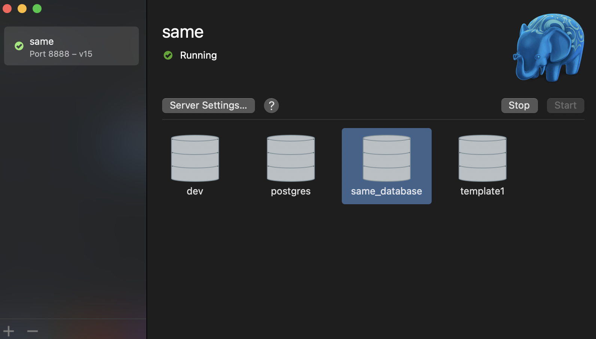

# Project information

This project create for SAME compani how test task project.
In project used PostgresSQL, Express, CRUD API.

# Start project;

1. In project terminal run "npm i".

2. Create in Postgres new server the 8888 port.
   
   
3. Initial you server.
   

4. Run terminal db.
   
5. In psql terminal paste:

   <pre>
      CREATE DATABASE same_database;
   </pre>

   

   You must see there:

   

6. Past in same_database psql terminal :
   <pre>
      CREATE TYPE userRoles AS ENUM ('Admin', 'User');
      ALTER TABLE users ADD FOREIGN KEY (profileId) REFERENCES profiles(id);
   
      CREATE TABLE users (
      id SERIAL PRIMARY KEY,
      username VARCHAR(255),
      email VARCHAR(255),
      role userRoles,
      dataCreate TIMESTAMP,
      profileid INT
      );
   </pre>

   Wait string CREATE TABLE

7. Past in psql terminal for create profile table:

   <pre>
   CREATE TYPE state_types AS ENUM ('Male', 'Female', 'Other');
   create TABLE profile (
   id Serial PRIMARY KEY,
   firstname VARCHAR(255),
   lastname VARCHAR(255),
   state state_types
   );
   </pre>

   Wait string CREATE TABLE and run you db in postgres.

8. In terminal project past "npm start dev" for start developer mode.
   You can see in terminal:
   <pre>
      Connected to the database
      server start on port 8080
   </pre>

# Use project

For test project you can use "Postman" last version.

Example request:

- all users GET "http://localhost:8080/api" no body.
  
- all users by role GET "http://localhost:8080/api/:role" no body.
  
- create user POST "http://localhost:8080/api" body:
<pre>
  {
    "username": "Example username",
    "email": "Example email",
    "role": "Admin or User",
    "firstname": "Example firstname",
    "lastname": "Example lastname",
    "state": "Male or Female or Other"
  }
</pre>

- update any property PUT "http://localhost:8080/api/:id" body:
It is need that there is 1 field in the request, user or profile, and you can specify only the data that is in the example
<pre>
    {
        "user": {
            "username": "Example username",
            "email": "Example email",
            "role": "Admin or User",
        },
        "profile":{
             "firstname": "Example firstname",
             "lastname": "Example lastname",
             "state": "Male or Female or Other"
        }
    }
</pre>

- delete user POST "http://localhost:8080/api/:id" no body.
